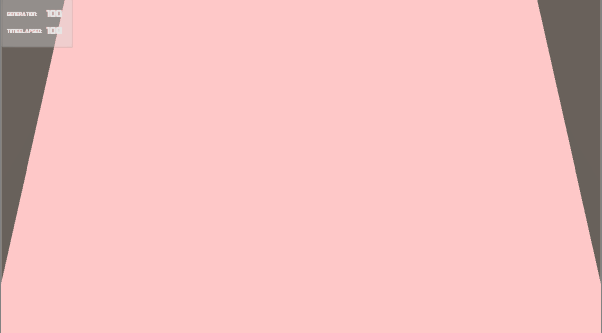

# Basic-genetic-algorithm
You have to click on the cubes that you do not want to breed based on their color and size. The ones that are left for the end will breed and move on their genetics (size and color) to the next generations.

